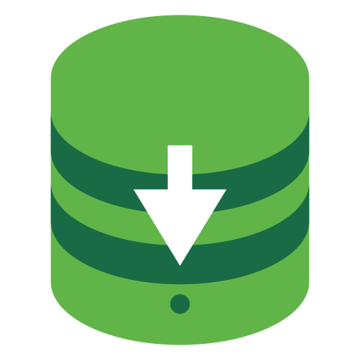

<p align="center">
  
</p>

# DBDump

[English](README.md) · **Français**

**Sauvegardez vos bases de données en un clic, depuis une app de bureau.**

PostgreSQL · MySQL/MariaDB · SQLite · MongoDB — **100 % local**, aucune donnée
n'est envoyée sur Internet, aucun serveur à installer.

---

## Sommaire

- [Fonctionnalités](#fonctionnalités)
- [Installation](#installation)
- [Utilisation](#utilisation)
- [Moteurs & outils requis](#moteurs--outils-requis)
- [Sécurité & confidentialité](#sécurité--confidentialité)
- [Langues](#langues)
- [Développement](#développement)
- [Construire & publier](#construire--publier)
- [Documentation](#documentation)

---

## Fonctionnalités

- **Dump** de PostgreSQL, MySQL/MariaDB, SQLite et MongoDB.
- Formats adaptés à chaque moteur (custom, SQL brut, répertoire, archive…),
  **compression gzip**, et filtres : schéma seul, données seules, exclusion de
  tables.
- **pg_dump inclus à la demande** : si PostgreSQL n'est pas installé sur la
  machine, DBDump télécharge une version portable au premier dump — puis
  fonctionne hors-ligne. Rien à configurer.
- Connexions enregistrées (chiffrées), **test de connexion**, et **journal en
  direct** pendant la sauvegarde.
- **Sauvegardes programmées** : toutes les N heures, chaque jour, les jours de
  semaine choisis, à date fixe dans le mois, ou une seule fois à une date donnée.
  DBDump les exécute en fond (icône de barre de menus, lancement au démarrage en
  option) et rattrape une exécution manquée pendant qu'il était fermé. Rétention
  facultative : ne garder que les N dernières sauvegardes.
- **Destinations multiples**, en parallèle : dossier local, disque externe, NAS
  ou partage réseau, **SFTP**, **FTP/FTPS**, et stockage **compatible S3**
  (Amazon S3, MinIO, Cloudflare R2). Un dump, plusieurs copies — avec l'option
  de supprimer le fichier local dès qu'une destination a confirmé.
- **Surveillance** : espace libre de chaque volume et de chaque destination, CPU
  et mémoire de la machine et des outils de dump, débit d'écriture et temps
  restant estimé pendant une sauvegarde.
- Disponible sur **macOS** (Apple Silicon & Intel), **Windows** et **Linux**.
- Interface et messages en **anglais et français**.

---

## Installation

Téléchargez l'installeur de votre système sur la
**[page des Releases](../../releases/latest)**.

| Système             | Fichier à télécharger        |
| ------------------- | ---------------------------- |
| macOS Apple Silicon | `dbdump_x.y.z_aarch64.dmg`   |
| macOS Intel         | `dbdump_x.y.z_x64.dmg`       |
| Windows 10 / 11     | `dbdump_x.y.z_x64-setup.exe` |
| Linux               | `.AppImage` ou `.deb`        |

macOS est **signé et notarisé par Apple** : l'app s'ouvre normalement, sans aucune
manipulation. Sur **Windows**, un avertissement SmartScreen peut encore apparaître
au premier lancement tant que la signature de code n'est pas déployée — voici
comment passer.

### macOS — aucun avertissement

L'application est signée avec un certificat **Apple Developer ID** puis
**notarisée** par Apple. Ouvrez le `.dmg` et glissez `DBDump` dans `Applications` :
elle démarre directement.

### Windows — « Windows a protégé votre ordinateur »

SmartScreen prévient pour les applications encore peu téléchargées. Cliquez
**Informations complémentaires → Exécuter quand même**. _(La signature de code est
en cours de déploiement pour supprimer cet avertissement.)_

### Linux

L'AppImage se lance directement (au besoin : `chmod +x dbdump_*.AppImage`). Le
`.deb` s'installe via `sudo dpkg -i dbdump_*.deb` ou votre gestionnaire de
paquets.

---

## Utilisation

1. **Ajouter une connexion** — choisissez le moteur, renseignez
   hôte / port / utilisateur / base (ou un fichier pour SQLite). Le bouton
   **Tester** vérifie l'accès avant d'enregistrer.
2. **Lancer une sauvegarde** — sélectionnez le format et les options (compression,
   schéma seul, tables exclues…), puis **Lancer le dump**. Une fenêtre affiche la
   progression et le journal en direct.
3. **Récupérer le fichier** — à la fin : **Ouvrir le dossier** ou **Copier vers
   Téléchargements**.

---

## Moteurs & outils requis

DBDump s'appuie sur les outils officiels de chaque moteur. L'app **indique ceux
qui manquent** et comment les installer selon votre système.

| Moteur          | Outil       | Remarque                                       |
| --------------- | ----------- | ---------------------------------------------- |
| PostgreSQL      | `pg_dump`   | **Téléchargé automatiquement** s'il est absent  |
| MySQL / MariaDB | `mysqldump` | À installer (client MySQL/MariaDB)             |
| SQLite          | `sqlite3`   | Souvent déjà fourni par le système             |
| MongoDB         | `mongodump` | MongoDB Database Tools                         |

> DBDump retrouve ces outils **même lancé depuis le Finder ou le Dock**, où les
> apps n'héritent pas du `PATH` du terminal : il complète automatiquement le
> `PATH` avec les emplacements usuels (Homebrew, installeurs PostgreSQL/MySQL/
> MongoDB…).

---

## Sécurité & confidentialité

- **Tout reste local.** Aucune donnée ni identifiant ne quitte votre machine.
  Pas de télémétrie, pas de compte.
- **Mots de passe jamais dans la ligne de commande.** Ils sont transmis aux
  outils par variable d'environnement (`PGPASSWORD`, `MYSQL_PWD`) ou sur stdin
  (`mongodump`), jamais en argument — l'argv est lisible dans `ps` par tout
  utilisateur de la machine. Le type `Connection` n'a même pas de champ
  `password` : impossible de le sérialiser par accident.
- **Chiffrement au repos.** Les identifiants sont conservés dans un coffre
  chiffré **AES-256-GCM** (`~/.dbdump/secrets.enc`) ; le fichier des connexions
  (`connections.enc`) est chiffré de la même façon. La clé locale
  (`~/.dbdump/secrets.key`, permissions `0600`) ne quitte jamais la machine.

- **Les secrets des destinations** (mots de passe SFTP/FTP, phrases de passe de
  clés, clés secrètes S3) vivent dans ce même coffre, jamais dans les fichiers de
  configuration.
- **Les clés d'hôte SSH sont vérifiées.** Une destination SFTP dont l'hôte n'est
  pas déjà dans votre `~/.ssh/known_hosts` est refusée, empreinte affichée :
  accepter n'importe quelle clé reviendrait à offrir vos sauvegardes à qui sait
  s'intercaler sur le réseau. Lancez une fois `ssh utilisateur@hôte`, vérifiez
  l'empreinte, et DBDump se connectera.

  > **Compromis assumé.** DBDump n'utilise pas le trousseau système (Keychain,
  > Credential Manager, Secret Service) : sans certificat de signature stable,
  > celui-ci redemande le mot de passe de session à chaque accès. Le coffre
  > fichier supprime cette friction sur toutes les plateformes, au prix d'une
  > clé au repos sur le disque. Elle protège d'un autre utilisateur de la
  > machine (permissions `0600`), pas d'un logiciel malveillant lancé sous votre
  > propre compte.

---

## Langues

Toute la plateforme est disponible en **anglais (langue principale) et
français** :

- **Landing** — anglais sur `/`, français sur `/fr/`. Chaque version est une
  vraie page statique avec son `<html lang>`, son URL canonique et ses
  alternates `hreflang` : les deux sont indexables.
- **App** (`/app/`, la fenêtre chargée par le desktop) — un seul build, langue
  résolue à l'exécution : celle que vous avez choisie (mémorisée), sinon les
  préférences du système, sinon l'anglais.
- **Messages du backend** (conseils d'installation, test de connexion, erreurs
  et progression du dump) également localisés : le frontend transmet sa langue à
  chaque commande Tauri. La sortie de `pg_dump` & co. est relayée telle quelle —
  c'est la cause exacte, la traduire la rendrait introuvable.

Ajouter une chaîne ou une langue : voir **[docs/fr/i18n.md](docs/fr/i18n.md)**.

---

## Développement

### Structure

```
dbdump/
├── frontend/   Next.js + Tailwind + shadcn/ui — toute l'interface + la landing
└── desktop/    Tauri (Rust) — tout ce qui touche au système
```

Ce ne sont **pas** des workspaces : chaque dossier a son `package.json` et
s'installe séparément. Pour savoir où chercher :

| Ce que vous cherchez               | Où                                                 |
| ---------------------------------- | -------------------------------------------------- |
| Un écran, un formulaire, un bouton | `frontend/src/`                                    |
| Les textes, les traductions        | `frontend/src/i18n/`, `desktop/src/i18n.rs`        |
| L'exécution de `pg_dump` & co.     | `desktop/src/commands.rs`, `desktop/src/runner.rs` |
| Les arguments passés aux outils    | `desktop/src/engines.rs`                           |
| Localisation des binaires (PATH)   | `desktop/src/path_env.rs`                          |
| Mots de passe, chiffrement         | `desktop/src/secrets.rs`, `desktop/src/store.rs`   |
| Fenêtre, permissions               | `desktop/tauri.conf.json`, `desktop/capabilities/` |

### Routes

Un seul projet Next.js produit le site public *et* la fenêtre embarquée par
l'app desktop :

| Route   | Sortie               | Rôle                                          |
| ------- | -------------------- | --------------------------------------------- |
| `/`     | `out/index.html`     | Landing en anglais                            |
| `/fr/`  | `out/fr/index.html`  | Landing en français                           |
| `/app/` | `out/app/index.html` | UI de dump — chargée par Tauri, masquée nginx |

Chacune des trois a sa propre racine (route groups `(en)`, `(fr)`, `(app)`) pour
que `<html lang>` soit correct **dans le HTML servi**, sans attendre
l'hydratation.

### Prérequis

Node 20+, Rust (via [rustup](https://rustup.rs)), et — pour de vrais dumps — les
outils du moteur visé (voir [ci-dessus](#moteurs--outils-requis) ; `pg_dump` est
téléchargé tout seul si absent).

### Lancer l'app

```bash
# une fois
npm --prefix frontend install
npm --prefix desktop install

# l'app complète (lance le frontend automatiquement, port 1420)
npm --prefix desktop run dev
```

### Travailler sur l'UI sans Rust

```bash
npm --prefix frontend run dev
```

Ouvert dans un navigateur, le frontend bascule sur un **backend simulé**
(`frontend/src/lib/backend/mock.ts`) : tous les écrans sont pilotables, y compris
les cas d'erreur, mais aucun vrai dump n'est produit. Un badge « démo » le
rappelle dans la barre latérale.

### Comment les deux moitiés se parlent

`frontend/src/lib/backend/` définit un contrat TypeScript (`Backend`) avec deux
implémentations : `tauri.ts` (les vraies commandes) et `mock.ts` (le navigateur).
`getBackend()` choisit selon l'environnement. **Aucun composant React n'appelle
`invoke()` directement** — ça garde l'UI testable hors de Tauri.

Le frontend envoie des **options structurées**, jamais une commande. C'est
`desktop/src/engines.rs` qui construit l'argv réellement exécuté ; laisser
l'écran dicter la ligne de commande ouvrirait une injection pour rien.
`frontend/src/lib/dump-command.ts` en est un miroir **d'affichage seulement**
(l'aperçu copiable dans l'UI) : les deux doivent rester alignés.

### Tests

```bash
npm --prefix desktop run test   # cargo test
```

Ils verrouillent l'invariant clé : **aucun mot de passe dans l'argv**, quel que
soit le moteur.

---

## Construire & publier

La construction des installeurs (macOS/Windows/Linux), la signature et la
publication automatique via GitHub Releases sont décrites dans
**[docs/fr/packaging.md](docs/fr/packaging.md)**.

---

## Documentation

| Document                                     | Contenu                                      |
| -------------------------------------------- | -------------------------------------------- |
| [docs/fr/packaging.md](docs/fr/packaging.md) | Build, signature, release, hébergement       |
| [docs/fr/i18n.md](docs/fr/i18n.md)           | Fonctionnement du bilinguisme EN/FR          |

Versions anglaises : [docs/en/](docs/en/).

---

## Licence

[MIT](LICENSE).
